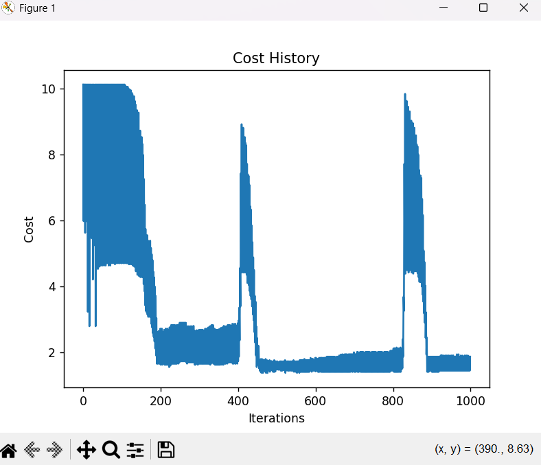

# Project 3: Logistic Regression from Scratch

## Goal

The primary goal of this project is to implement the Logistic Regression algorithm for binary classification from scratch using Python and NumPy. This includes understanding and implementing the sigmoid function, the logistic cost function (binary cross-entropy/log loss), deriving and implementing its gradient, and utilizing various forms of Gradient Descent for optimization. The project also aims to apply L2 regularization (though the reported run uses no regularization) and visualize the model's behavior through cost history plots.

## Core Concepts Applied

* **Python Programming:** Scripting, function definition, object-oriented programming (class structure).
* **NumPy for Numerical Computing:** Array manipulation, vectorization, linear algebra operations.
* **Applied Linear Algebra:** Vector and matrix operations (e.g., dot products for hypothesis and gradient calculation).
* **Applied Multivariable Calculus:** Understanding of the sigmoid function, cost function derivation, and gradient derivation.
* **Machine Learning:**
  * Logistic Regression concepts.
  * Binary classification.
  * Gradient Descent (Batch, Stochastic, Mini-Batch).
  * Cost functions (Log Loss / Binary Cross-Entropy).
  * Hypothesis representation.
  * Decision boundary (conceptual and visual for 2D cases).
  * Regularization (L2).
  * Model training and prediction.
* **Data Visualization (Matplotlib):** Plotting cost function convergence.

## Tech Stack

* **Language:** Python 3.x
* **Libraries:**
  * NumPy: For numerical computations and array operations.
  * Matplotlib: For plotting visualizations (cost history).
  * Scikit-learn: For dataset loading (`load_breast_cancer`), data splitting (`train_test_split`), feature scaling (`StandardScaler`), and performance metrics (`accuracy_score`).

## Features Implemented

The `LogisticRegression` class (`Logistic_Regression.py`) includes the following features:

* **Sigmoid Function:** Computes the sigmoid activation.
* **Cost Function:** Calculates the Binary Cross-Entropy (Log Loss), with optional L2 regularization.
* **Gradient Calculation:** Computes the gradient of the cost function, including the L2 regularization term.
* **Optimization Algorithms (Solvers):**
  * Batch Gradient Descent (BGD)
  * Stochastic Gradient Descent (SGD)
  * Mini-Batch Gradient Descent (MBGD)
* **L2 Regularization:** Penalty term added to the cost function and gradient to prevent overfitting (can be controlled by `lambda_val`).
* **`fit` Method:** Trains the model using a specified solver and hyperparameters. Handles internal addition of the bias term to features.
* **`predict` Method:** Predicts class labels (0 or 1) for new data based on a 0.5 probability threshold. Handles internal addition of the bias term.
* **`plot_cost_history` Method:** Visualizes the cost function's value over iterations/epochs to monitor convergence.
* **`plot_decision_boundary` Method:** Visualizes the learned decision boundary for 2D datasets (though primary analysis here is on a higher-dimensional dataset).

## File Structure

* `Logistic_Regression.py`: Contains the `LogisticRegression` class implementation.
* `sample_run.py`: A script demonstrating how to use the `LogisticRegression` class, including data loading (Breast Cancer dataset), preprocessing, training, evaluation, and visualization.
* `README.md`: This file.
* `images/`: Folder containing image assets for this README.
  * `Cost_History_Logistic_Regression.png`: Plot of the cost history during training on the Breast Cancer dataset.

## How to Run

1. **Prerequisites:**
    * Python 3.x
    * Ensure the following libraries are installed:

        ```bash
        pip install numpy matplotlib scikit-learn
        ```

2. **Clone the Repository (if applicable) or Download Files:**
    Make sure `Logistic_Regression.py`, `sample_run.py`, and the `images/` folder (with `Cost_History_Logistic_Regression.png` inside) are correctly placed.
3. **Execute the Sample Script:**
    Open a terminal or command prompt, navigate to the directory containing the files, and run:

    ```bash
    python sample_run.py
    ```

    This script will train the model on the Breast Cancer dataset, print accuracy, and display the cost history plot.

## Findings and Observations

This section details the performance and behavior of the implemented Logistic Regression model, primarily focusing on its application to the Breast Cancer dataset.

### Breast Cancer Dataset Analysis

* **Initial Challenges - Importance of Feature Scaling:**
    When initially training the model on the raw (unscaled) Breast Cancer dataset, the cost function exhibited significant instability. The cost would decrease but then experience large, periodic spikes, making it difficult to assess true convergence. This highlighted a critical prerequisite for gradient-based optimization algorithms: **feature scaling**. Features in the Breast Cancer dataset have vastly different ranges and magnitudes. Without scaling, features with larger values disproportionately influence the gradient and cost, leading to an unstable optimization path and potentially causing numerical issues in the sigmoid and logarithmic calculations.

* **Implementation of Feature Scaling:**
    To address the instability, `sklearn.preprocessing.StandardScaler` was incorporated into the data preprocessing pipeline in `sample_run.py`. The scaler was fit **only** on the training portion of the Breast Cancer dataset and then used to transform both the training and test sets. This ensures that the model learns from consistently scaled features and that there is no data leakage from the test set into the scaling process.

    ```python
    # Key scaling steps from sample_run.py:
    from sklearn.preprocessing import StandardScaler
    # ...
    scaler = StandardScaler()
    X_train_scaled = scaler.fit_transform(X_train) # Fit on training data
    X_test_scaled = scaler.transform(X_test)       # Transform test data
    # ...
    # Model trained and predictions made on these scaled datasets
    model.fit(X_train_scaled, y_train, ...)
    predictions = model.predict(X_test_scaled)
    ```

* **Results After Scaling:**
  * **Training Configuration:** The model was trained on the scaled Breast Cancer dataset using the following configuration:
    * Solver: `batch_gd`
    * Learning Rate: `0.01`
    * Number of Iterations: `1000`
    * L2 Regularization (`lambda_val`): `0.0` (No regularization applied for this reported run)
  * **Accuracy:** After training on the scaled data, the model achieved an accuracy of **0.9474 (or 94.74%)** on the test set.

  * **Cost History and Convergence:**
        Despite proper feature scaling and attempts to mitigate numerical issues (e.g., clipping hypothesis values before log calculation), the cost function during training continued to exhibit periodic spikes, as shown below. However, the general trend between these spikes was a decrease in cost, and the model ultimately converged to a state that yielded good predictive accuracy.

    

    The final cost after training was approximately **1.4170**. The persistence of these spikes, even with high accuracy, suggests subtle numerical interactions within the optimization process for this specific dataset and model configuration, which could be a subject for further investigation.

* **Effect of L2 Regularization:**
    For the reported run, L2 regularization was not applied (`lambda_val = 0.0`). The model has the capability to include L2 regularization, which can be activated by setting a `lambda_val` greater than zero during model initialization. This feature is intended to help prevent overfitting by penalizing large theta values, though its impact was not specifically evaluated in this primary result.

## Conclusion

This project successfully implemented a Logistic Regression model from scratch, encompassing various gradient descent optimizers, an option for L2 regularization, and visualization tools. The process highlighted the importance of mathematical understanding, careful implementation of numerical methods, and critical data preprocessing steps like feature scaling. The model demonstrated good predictive performance on the Breast Cancer dataset, achieving 94.74% accuracy without regularization, though its cost convergence exhibited some numerical instability that warrants further investigation.

## Possible Future Work/Improvements

* Further investigate and resolve the cause of the periodic cost spikes observed on the Breast Cancer dataset. This could involve exploring different numerical stabilization techniques or adaptive learning rate methods.
* Implement learning rate schedules for Stochastic Gradient Descent and Mini-Batch Gradient Descent for potentially more stable and faster convergence.
* Add early stopping criteria to prevent overfitting and reduce unnecessary computation if the validation cost stops improving.
* Incorporate other evaluation metrics (e.g., precision, recall, F1-score, ROC-AUC) for a more comprehensive model assessment.
* Conduct experiments with different L2 regularization strengths (`lambda_val`) to observe its impact on model performance and theta values.
* Conduct a detailed comparison with Scikit-learn's `LogisticRegression` across various configurations.
* Test and visualize performance on a 2D synthetic dataset to fully utilize the `plot_decision_boundary` method and provide clearer visual intuition for the algorithm.
